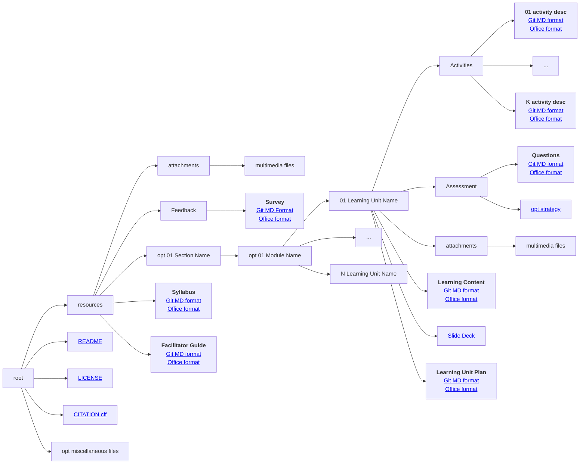

# Stage 3 - Design

!!! quote ""

    Design is intelligence made visible - *Alina Wheeler*

## Time to brainstorm

  

    

      
      
<small class="text-muted">
                Image by <a href="https://pixabay.com/users/geralt-9301/?utm_source=link-attribution&utm_medium=referral&utm_campaign=image&utm_content=3829057">Gerd Altmann</a> from <a href="https://pixabay.com//?utm_source=link-attribution&utm_medium=referral&utm_campaign=image&utm_content=3829057">Pixabay</a> </small>
                

    

    

      

            <h2 class="card-title">Concept map</h2>
            
Build a concept map of your learning materials aligning with the MVS profiles.

            
The aligned MVS profile can help you cristalize the learning objectives using MVS taxonomy.

            
Each MVS profile defines a list of technical and soft skills required for the profile. Think on how to incorporate both aspects in your learning materials.

            <a href="https://fair-by-design-methodology.github.io/MVS/latest/MVS%20Profiles/Civil%20Servant/civil_servant/" class="btn btn-primary stretched-link">Go to MVS profiles catalogue</a>
      

    

  

## Structure is everything

- <i class="fa fa-cogs" aria-hidden="true"></i> Create an intuitive logical organisation of all learning materials. 
- <i class="fa fa-cubes" aria-hidden="true"></i> The goal is for other people to easily reuse a single item (plan, activity, unit, assessment, ...).
- <i class="fa fa-sitemap" aria-hidden="true"></i> Use a hierarchical structure to combine learning units into larger compositions.

!!! example "How to organise the files"

    The diagram shows how to organise all files in folders and subfolders. Click on the links to discover and use pre-prepared templates.

!!! info "Syllabus is ready" 

    You should by now have the first draft of your <a href='https://fair-by-design-methodology.github.io/FAIR-by-Design_ToT/latest/Stage%203%20–%20Design/04-Conceptualisation/04-Conceptualisation/'>syllabus</a>. It contains all the fields from the RDA min metadata set plus the high level topics covered by the learning material.

??? info "Available feedback form"

    The <a href='https://fair-by-design-methodology.github.io/FAIR-by-Design_ToT/latest/Stage%203%20–%20Design/07-Facilitation/07-Facilitation/'> feedback form template </a> is ready to be used as is. All you need to do is change the name of the training. It should be shared with training participants after the training, to gather quantitative and qualitative feedback.

??? info "Available facilitation guide kit"

    The <a href='https://fair-by-design-methodology.github.io/FAIR-by-Design_ToT/latest/Stage%203%20–%20Design/07-Facilitation/07-Facilitation/'> facilitation guide </a> should help prepare for the actual training. If you don't want to develop your own, use something that is already available such as the [TRIPLE project TRAINING TOOLKIT](https://project.gotriple.eu/project-deliverables/triple-training-toolkit/).

??? info "Don't worry, we got you covered with templates"

    All templates are readily available for use in the specialised [templates repository](https://github.com/FAIR-by-Design-Methodology/templates). See the detailed training on how to use it step by step.

??? question "What about instructor notes?"

    Need to be detailed enough so that anyone can reuse the slides properly. Don't put them in the slide deck. This is what the learning content file is for.

## How to develop the learning content

<a href="https://www.csun.edu/sites/default/files/Holle-Lesson-Planning.pdf" class="btn btn-primary btn-lg btn-block">Read more about the Hunter Model</a>

- <i class="fa fa-bullseye" aria-hidden="true"></i> __1. Set Learning Objectives__ ... what is the goal
- <i class="fa fa-question-circle" aria-hidden="true"></i> __2. Identify Needs__ ... how to get there 
- <i class="fa fa-list-alt" aria-hidden="true"></i> __3. Plan__ ... share the agenda
- <i class="fa fa-heartbeat" aria-hidden="true"></i> __4. Hook__ ... why is the content important
- <i class="fa fa-user-secret" aria-hidden="true"></i> __5. Instruct__ ... watch how I do it
- <i class="fa fa-code-fork" aria-hidden="true"></i> __6. Practise__ ... you help me do it, I'll watch you do it
- <i class="fa fa-hand-o-right" aria-hidden="true"></i> __7. Wrap-Up__ ... foster retention and reinforcement
- <i class="fa fa-question-circle" aria-hidden="true"></i> __8. Evaluate__ ... monitor progress
- <i class="fa fa-info-circle" aria-hidden="true"></i> __9. Reflect__ ... how did it go?

<a href="https://fair-by-design-methodology.github.io/FAIR-by-Design_ToT/latest/Stage%203%20%E2%80%93%20Design/04-Conceptualisation/04-Conceptualisation/" class="btn btn-dark text-white btn-lg btn-block">Start an in-depth training on the Design stage....</a>
<a href="https://fair-by-design-methodology.github.io/FAIR-by-Design_Book/4%20-%20FAIR-by-design%20learning%20materials%20creation/4.1%20-%20Workflow%20stages%20description/413-design/" class="btn btn-dark text-white btn-lg btn-block">FAIR-by-Design Methodology: Design stage....</a>
